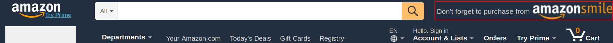
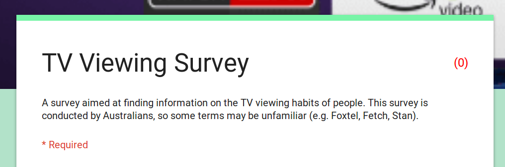
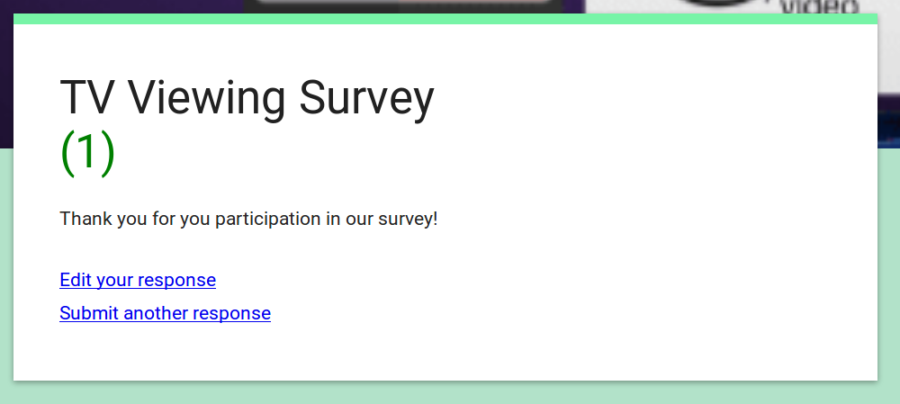
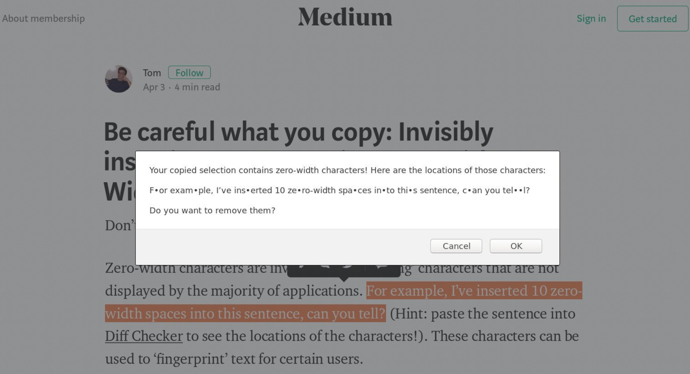
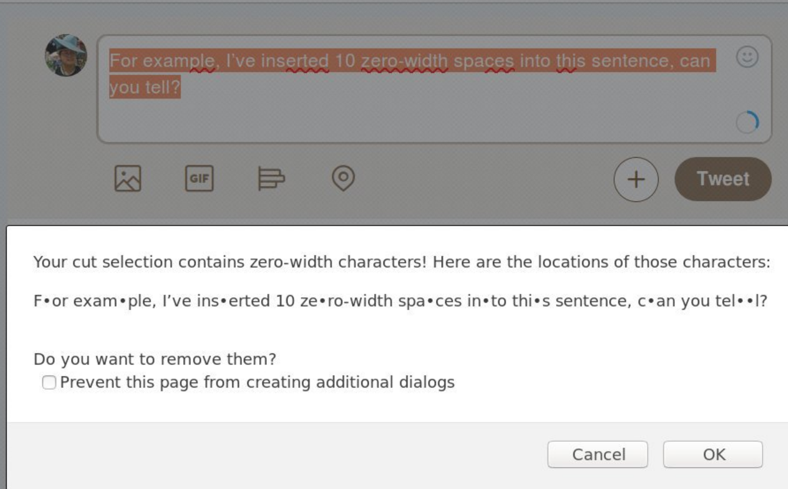
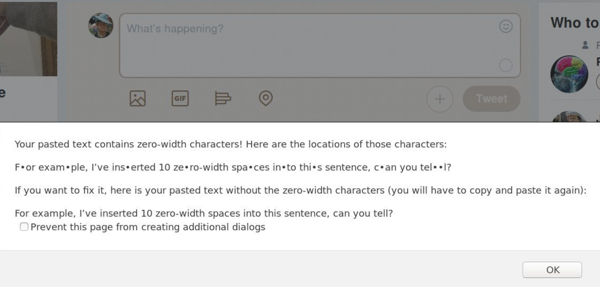
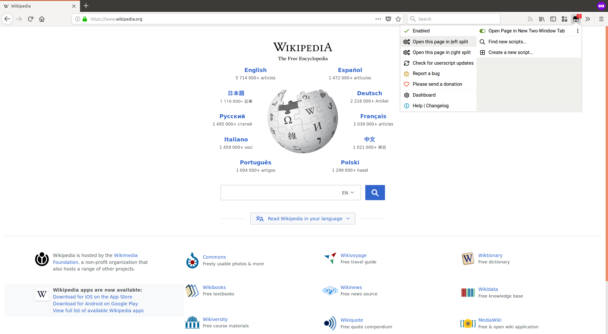
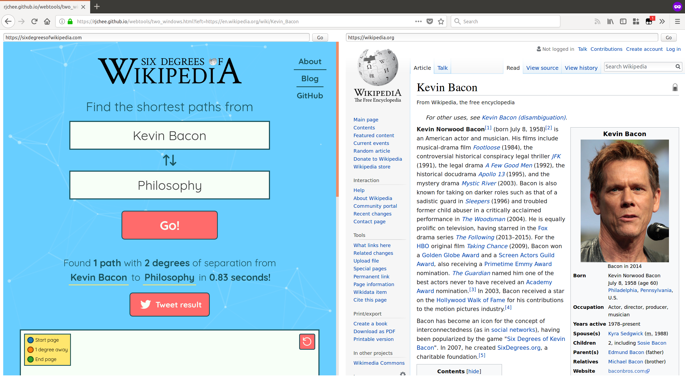
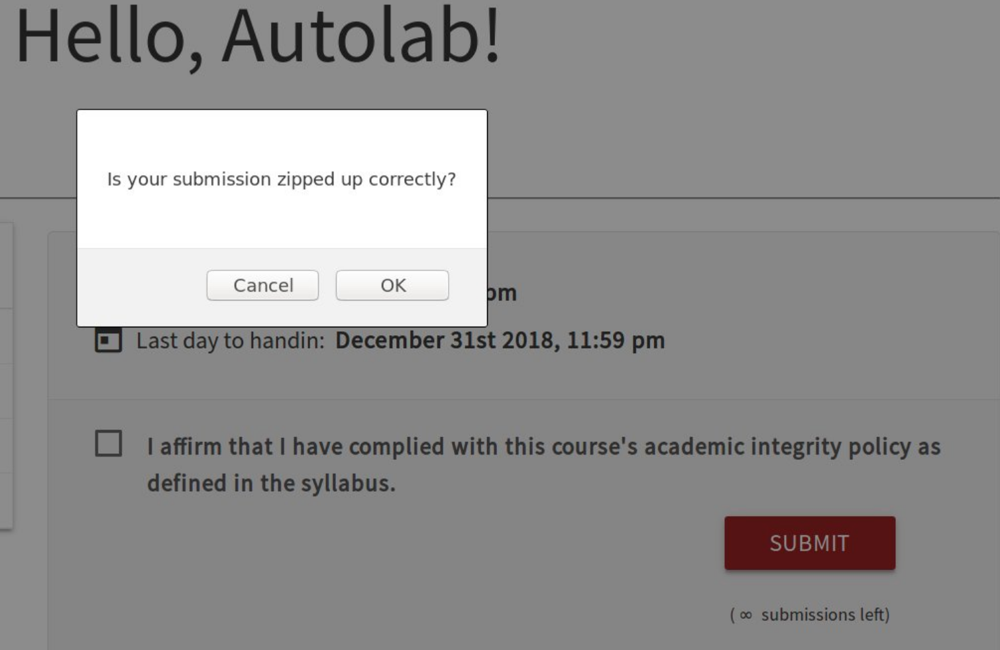
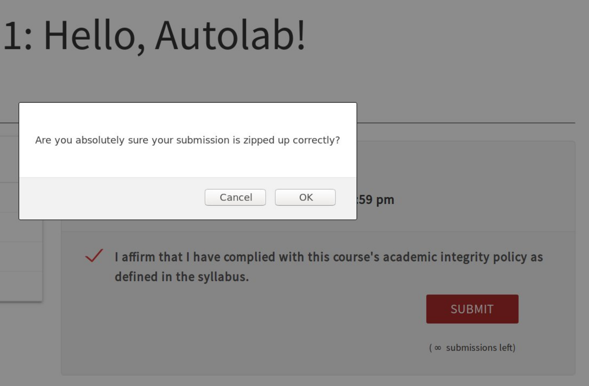

# my-userscripts
Userscripts that I use on my web browser. I have only tested these on
Tampermonkey in Firefox, but they should work in Chrome too. If you want to
install any of these in your own userscript manager, you can go to the script
on Github, and click "Raw", which should open up with Tampermonkey by default.

## Table of Contents
* [my-userscripts](#my-userscripts)
    * [Table of Contents](#table-of-contents)
    * [AmazonSmile Reminder](#amazonsmile-reminder)
    * [Have I Filled out This Form Before?](#have-i-filled-out-this-form-before)
    * [Send Like Keyboard Shortcut](#send-like-keyboard-shortcut)
    * [Prevent Messenger from Tracking Links](#prevent-messenger-from-tracking-links)
    * [Detect Zero-Width Characters When Copying Text](#detect-zero-width-characters-when-copying-text)
    * [Open Page in a New Two-Window Tab](#open-page-in-a-new-two-window-tab)
    * [Autolab Submission Protector](#autolab-submission-protector)

## [AmazonSmile Reminder](./amazonsmile_reminder.user.js)
This script adds a gentle reminder button to make your purchases through
AmazonSmile above the cart on https://www.amazon.com.

This is a picture of the script in action:
.

Clicking the AmazonSmile logo will take you to the same page but on the Amazon
Smile domain.

Install this script [here](../../raw/master/amazonsmile_reminder.user.js).

## [Have I Filled out This Form Before?](./indicate_completed_google_form.user.js)
This script adds a count next to Google Forms indicating the number of times
the form has been filled out before. This is implemented by storing the count
in that page's LocalStorage, so it will not remember the count if you switch
browsers or otherwise clear the storage.

Before filling out a google form, the script will add a red 0 next to the form's title.

After filling the form out, the 0 will change into a green number indicating the number of times the form has been completed.

Install this script [here](../../raw/master/indicate_completed_google_form.user.js).

## [Send Like Keyboard Shortcut](./send_like_shortcut.user.js)
This registers Ctrl+Shift+L as a keyboard shortcut on Facebook Messenger.
Holding Ctrl+Shift+L acts like holding the like button down, so the 'like'
emoji gets bigger the longer it is held.

Install this script [here](../../raw/master/send_like_shortcut.user.js).

## [Prevent Messenger from Tracking Links](./prevent_messenger_tracking.user.js)
This script prevents Facebook Messenger from rewriting links to go through
their own domain first when clicking on them. Whether or not this completely
prevents them from tracking your clicks on Messenger, I'm not sure, but it's a
start.

Install this script [here](../../raw/master/prevent_messenger_tracking.user.js).

## [Detect Zero-Width Characters When Copying Text](./detect_zero_width_clipboard_data.user.js)
[This article](https://medium.com/@umpox/be-careful-what-you-copy-invisibly-inserting-usernames-into-text-with-zero-width-characters-18b4e6f17b66)
describes how zero-width characters can be used to fingerprint people who copy
and paste text containing those characters. This script detects whether any
text which is copied and pasted on the browser contains zero-width characters,
and alerts if this happens.

Copying:

Cutting:

Pasting:

Install this script [here](../../raw/master/detect_zero_width_clipboard_data.user.js).

## [Open Page in a New Two-Window Tab](./open_page_in_two_window_tab.user.js)
Sometimes, you want to look at two windows at the same time without having to
deal with alt-tabbing. This script adds a shortcut to open the current page on
half of a single page at <https://rjchee.github.io/webtools/two_windows.html>.
Since this page is implemented using iframes, some websites won't work because
of the browser's Mixed Content Policy or because their servers implement the
X-Frame-Options header.

The shortcut is located in Tampermonkey's context menu.

After clicking it, the current page will open on the specified side of the website, and you can enter the URL you want for the other side to view two windows at once.

Install this script [here](../../raw/master/open_page_in_two_window_tab.user.js).

## [Autolab Submission Protector](./autolab_submission_protector.user.js)
At CMU, some classes accept homework submissions through Autolab. This websites
can automatically grade programming assignments, but it expects submissions to
be uploaded as tarballs. I always forget this, so I always lose at least one
submission per assignment. This script alerts whenever you click the submit
button, reminding you to zip the submission in the expected format. (It has no
idea what the expected format should be, so it's up to the user to figure that
out).

These are pictures of the alerts the script fires.

Install this script [here](../../raw/master/autolab_submission_protector.user.js).
